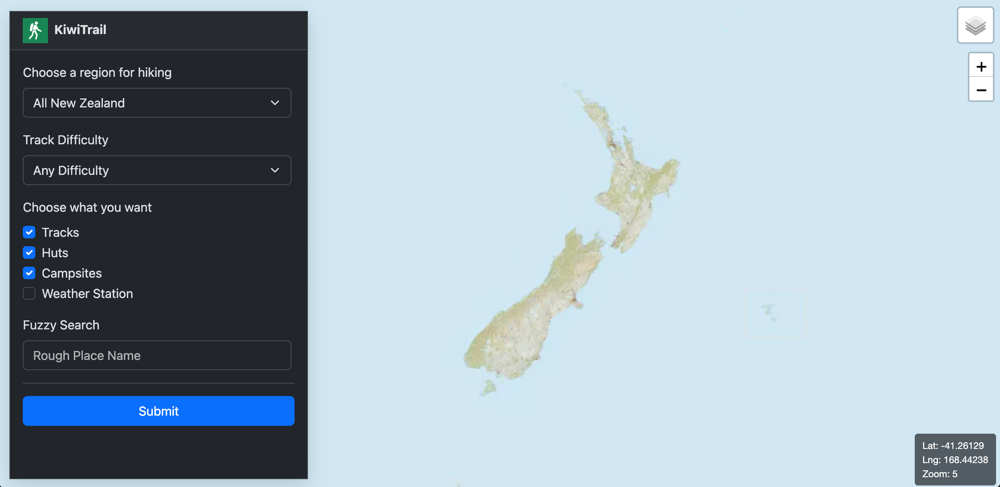
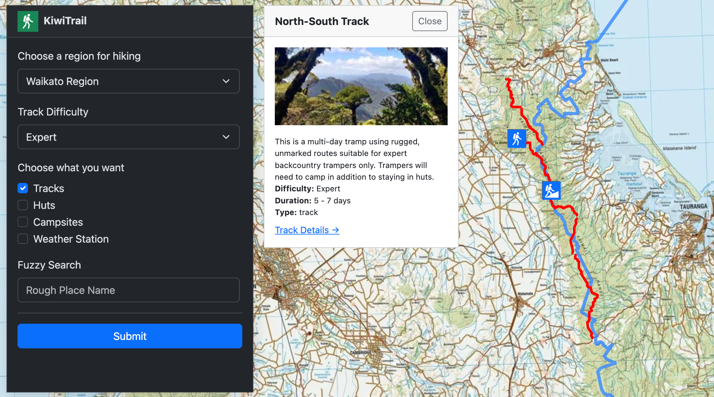
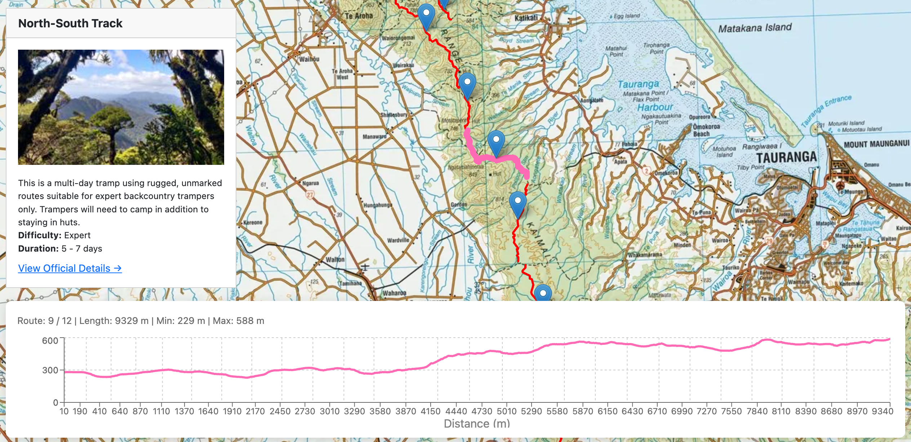

# KiwiTrail

**Full-stack geospatial web application built with React, FastAPI, PostGIS, Docker, and cloud deployment.**

KiwiTrail helps users discover outdoor destinations across New Zealand, including tracks, huts, and campsites sourced from NZ DOC open data.

Users can search destinations by region, explore trail information, view elevation profiles calculated from NZ 8m DEM data, check weather forecasts via MetService, and navigate to destinations using Google Maps.

## Live Demo

🚀 [Visit KiwiTrail](https://kiwitrail.vercel.app/)

## Screenshots

### Home Page


### Search by Region


### Trail Detail with Elevation


---

## Key Features

- Search NZ DOC tracks, huts, and campsites by region
- View outdoor destination details and route information
- Interactive trail elevation profiles generated from NZ 8m DEM data
- Direct links to MetService weather forecasts
- Google Maps navigation integration
- Responsive design for desktop and mobile devices

---

## Tech Stack

### Frontend
- React
- JavaScript / TypeScript
- CSS
- Deployed on Vercel

### Backend
- FastAPI
- Python
- REST API
- Docker
- Hosted on DigitalOcean Droplet

### Database
- PostgreSQL
- PostGIS

### Data Engineering & Geospatial Processing
- NZ DOC open datasets (tracks, huts, campsites)
- NZ 8m DEM elevation data
- Local data cleaning, transformation, and schema design
- Custom ETL pipeline into PostgreSQL/PostGIS
- Spatial queries and route processing
- Elevation extraction for trail profiles

---

## Data Pipeline

```text
Public NZ Datasets
(DOC + DEM + geospatial sources)
        ↓
Local Download & Processing
(cleaning / formatting / transformation)
        ↓
PostgreSQL + PostGIS Database
        ↓
FastAPI Backend
        ↓
React Frontend
